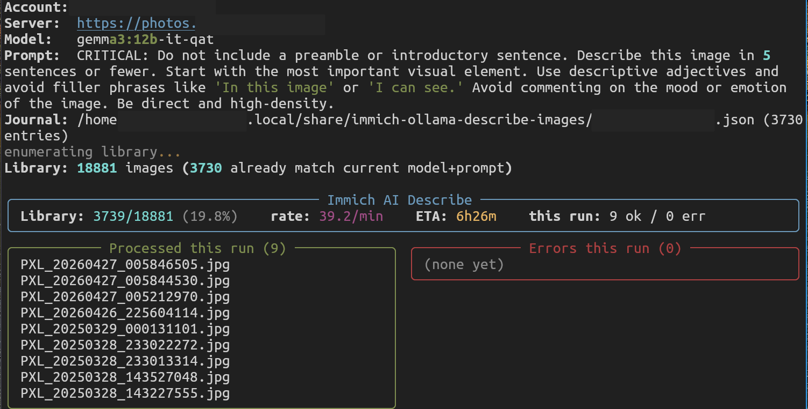
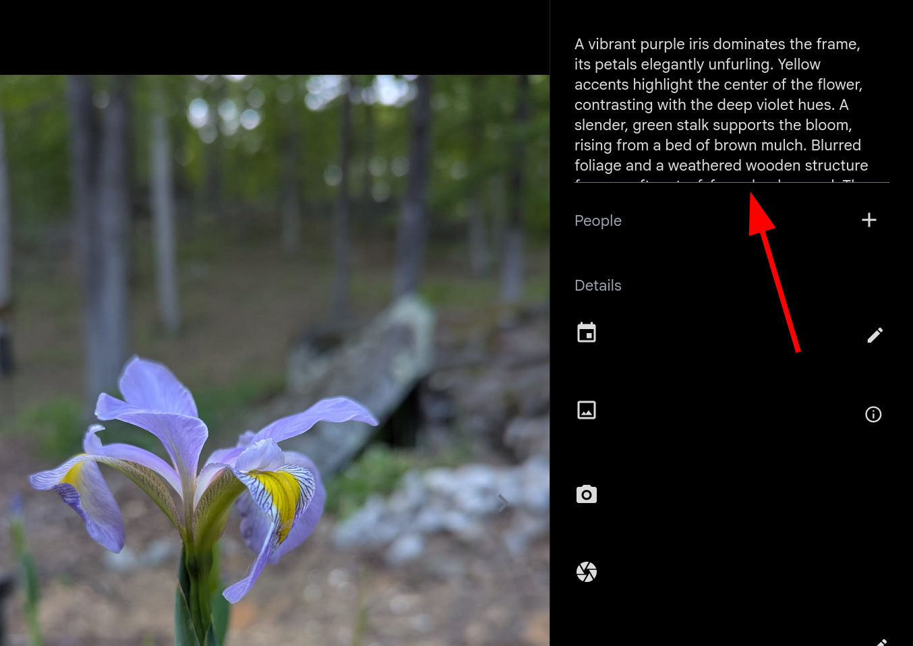
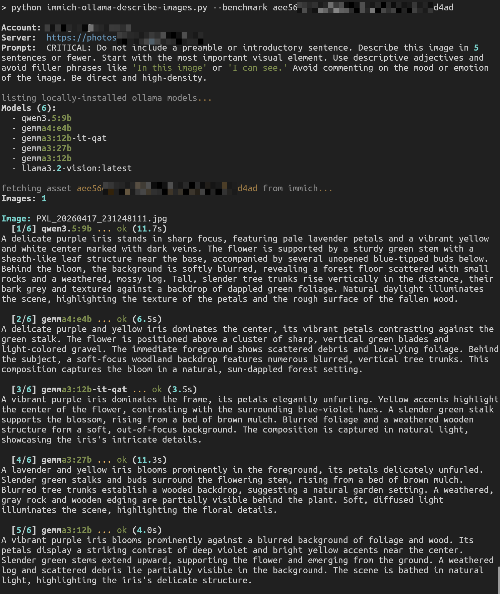

# immich-ollama-describe-images

Generate captions for every image in an [Immich](https://immich.app) library using a local [Ollama](https://ollama.ai) vision model, then write each caption back to the asset's `description` metadata field.

## Example



*Note:* The performance metrics of the script in this screenshot are from a server with a `GeForce RTX 5080 16GB` running `gemma3:12b-it-qat` on `ollama-0.21.2`.



## Requirements

- Python 3 with dependencies installed from `requirements.txt`:
  ```
  pip install -r requirements.txt
  ```
- A running Ollama server with the vision model pulled (e.g. `ollama pull gemma3:12b-it-qat`)
- An Immich API key with write access to the assets you want to caption.

## Usage

```bash
export IMMICH_API_KEY=your_key_here
python3 immich-ollama-describe-images.py --server https://your.immich.instance.url
```

*Tip:* Edit DEFAULT_SERVER in the script so that you don't have to specify your immich server URL each time.

### Options

For normal processing mode, use the following options:

| Flag            | Default                             | Purpose                               |
| --------------- | ----------------------------------- | ------------------------------------- |
| `--server URL`  | Set your server in `DEFAULT_SERVER` | Immich server base URL                |
| `--model NAME`  | `gemma3:12b-it-qat`                 | Ollama model to use                   |
| `--prompt TEXT` | (5-sentence describe prompt)        | Prompt sent to the model              |
| `--limit N`     | unlimited                           | Process at most N new assets this run |

### Resume / re-runs

Progress is journaled per-immich-account at `~/.local/share/immich-ollama-describe-images/<account>.json`, keyed by asset id and matched on **model + prompt + temperature**.

Re-running `immich-ollama-describe-images.py`:

- skips assets which were already captioned before with the same model+prompt+temperature,
- reprocesses assets when any of those change,
- is safe to interrupt with `ctrl-c`. The journal is written atomically after every asset is successfully processed.

_NOTE:_ The script overwrites any existing `description` on each asset it processes. There is no skip-if-already-set protection; it's designed this way to be easier to periodically re-run as models improve.

## Examples

```bash
# Describe up to 50 new assets with a different model
python3 immich-ollama-describe-images.py --model llama3.2-vision --limit 50

# Compare every locally-installed model on 8 sample images
python3 immich-ollama-describe-images.py --benchmark

# Compare every locally-installed model on a specific asset
python3 immich-ollama-describe-images.py --benchmark 4f3a...e21
```

## Benchmark Mode

There's also a special benchmark mode, used to benchmark and test changes to the models and prompts.

Benchmark mode uses `ollama.list()` to see all models that are downloaded to your local ollama instance, then either run the prompt through each model against the first 8 assets on your Immich server, or against the `[ASSET_ID]` that you specify.

Running `--benchmark` while specifying `[ASSET_ID]` prints the responses and benchmark data to STDOUT.

Running `--benchmark` without specifying an `[ASSET_ID]` causes `benchmark-ASSET_ID.txt` files to be written containing the responses from each of the first 8 Immich assets that were tested.

### Example


